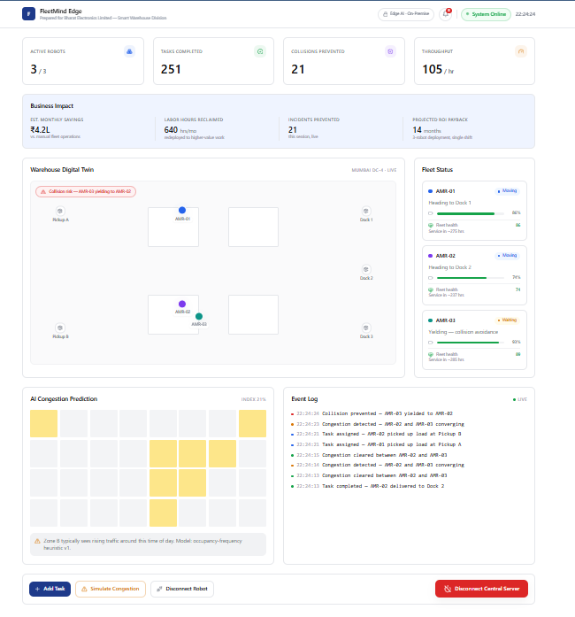
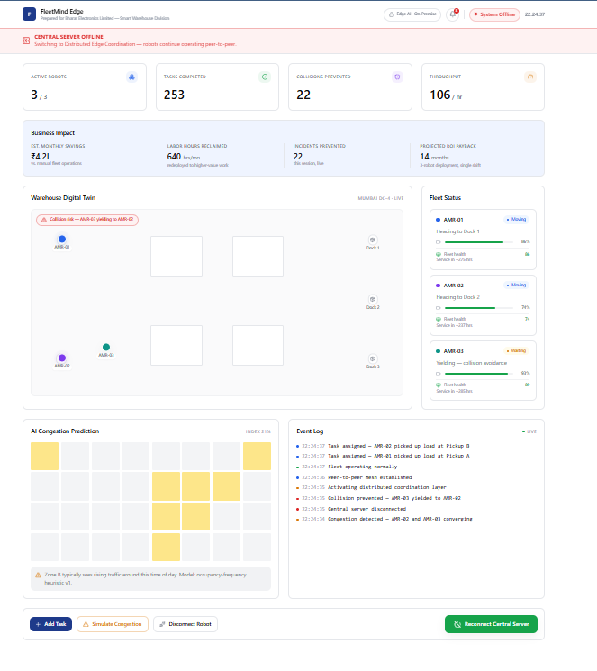
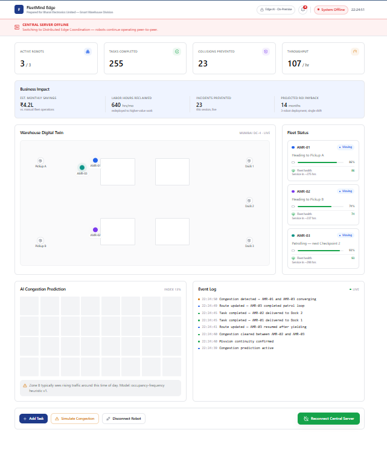
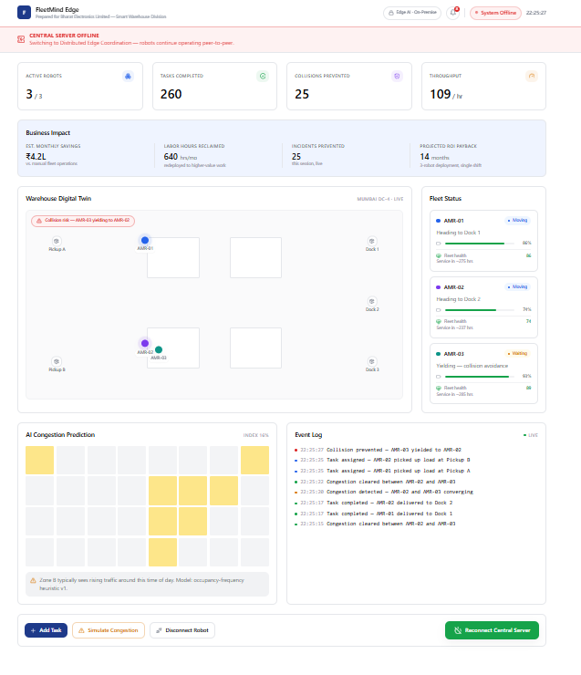

## Screenshots / Prototype Photos

Here are the key features of the FleetMind Edge dashboard in action:

**System Online: Main Dashboard & AI Congestion Prediction**

**Offline Failover: Distributed Edge Coordination Activated**

**Live Tracking: Task Assignment in Mesh Network**

**Collision Prevention: Successful Yielding while Offline**

